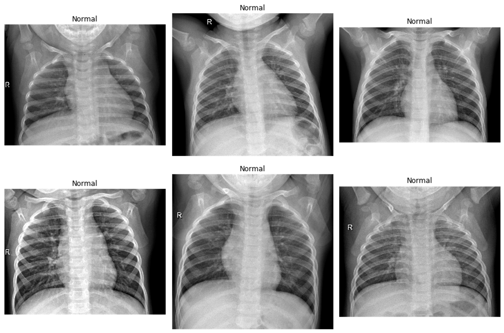
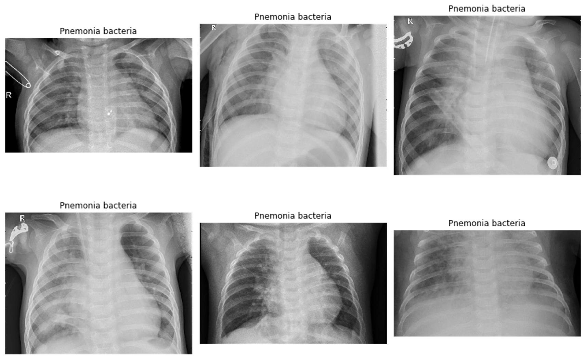
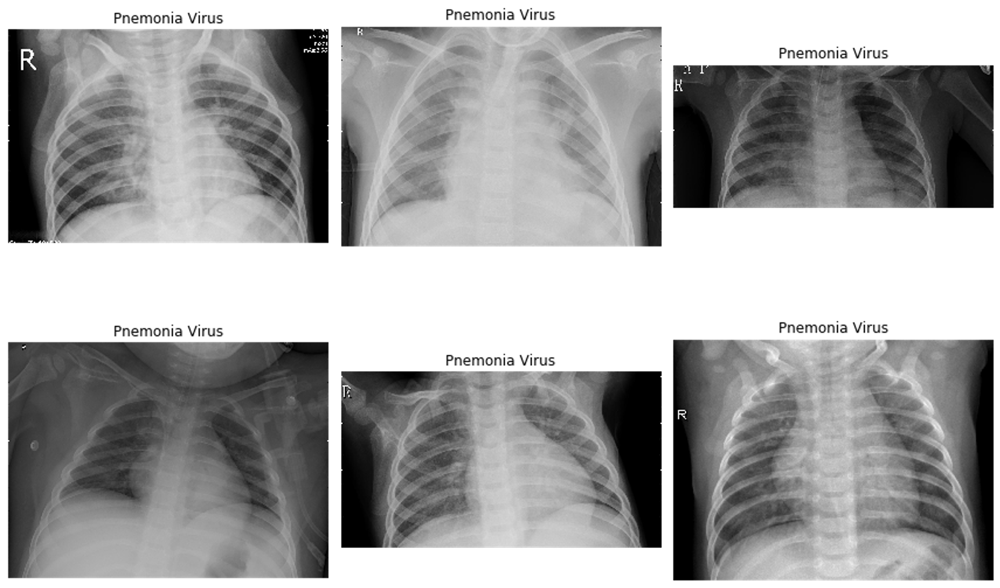
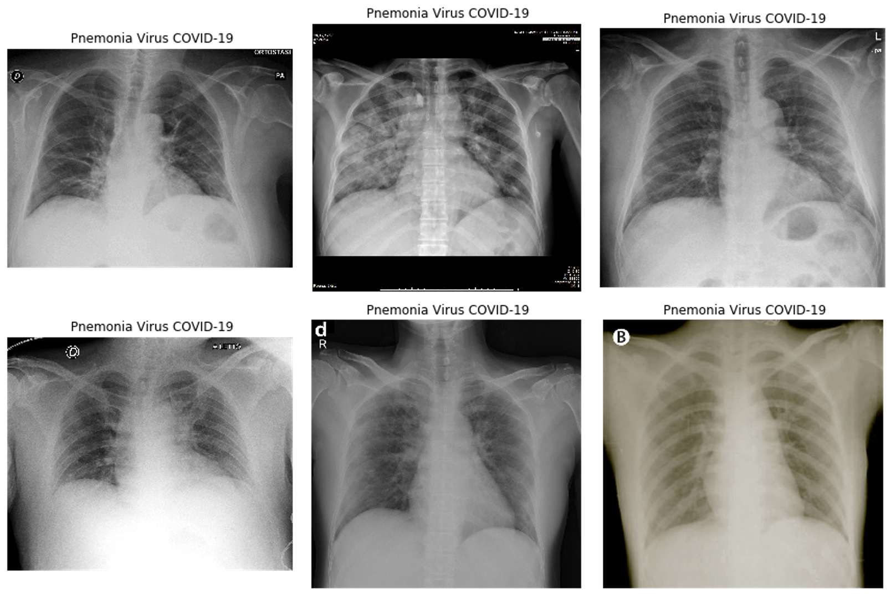
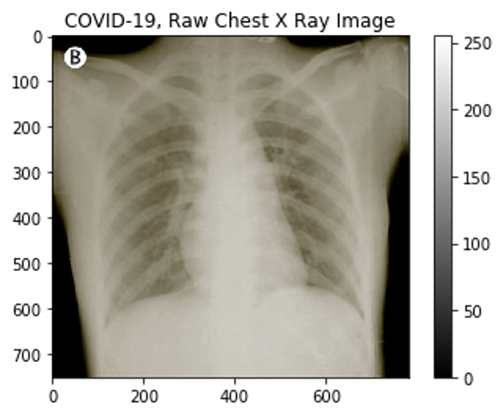
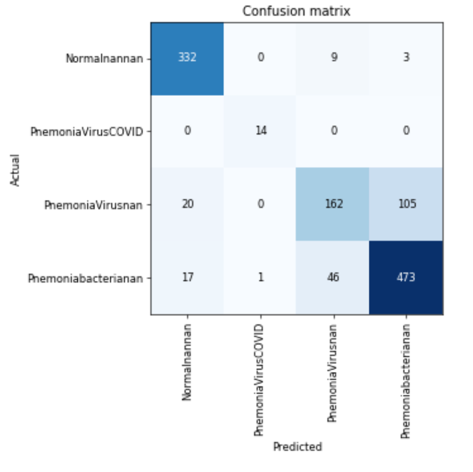
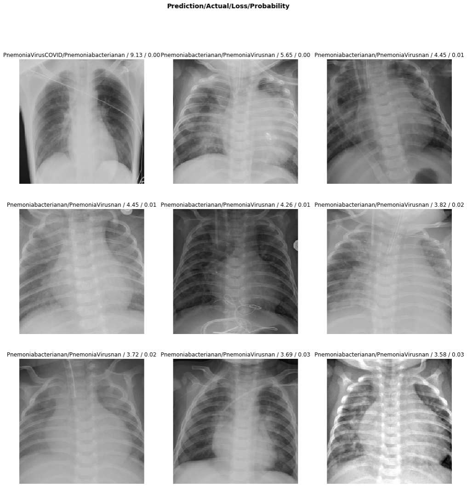

# COVID-19-pneumonia-claasification

A Deep Learning based chest X-ray image binary classifier model is presented. This model takes the chest X-ray images as an input and results the class (Pneumonia affected or Normal). It is a threefold operation: At first the X-ray images are normalized using batch normalization technique and then two pretrained Residual Neural Networks, with 50 and 34 hidden layers is trained with 5910 normal and Pneumonia chest X ray images. Finally, the trained deep learning model predicts in real time.

_Pneumonia is an infection in one or both lungs. Bacteria, viruses, and fungi cause it. The infection causes inflammation in the air sacs in your lungs, which are called alveoli. The alveoli fill with fluid or pus, making it difficult to breathe._

## 

## Nomral Chest-Xray:

## pneumonia-bacteria Chest-Xray:

## pneumonia-Virus Chest-Xray:

## pneumonia-Virus-COVID-19 Chest-Xray:

## Information about Image:

- The dimensions of the image are 750 pixels width and 781 pixels height, one single color channel 
- The maximum pixel value is 255.0000 and the minimum is 0.0000 
- The mean value of the pixels is 134.5100 and the standard deviation is 54.1969 

## Method: 
Before pre-processing the dataset is divided into Training and testing data with the ratio of 80:20.  After that, the images in training dataset are pre-processed. In this step each pixel value of an image is replaced by a new pixel value, this new value is calculated by subtracting the original pixel value with mean of all pixel values and then dividing by the standard deviation. 

It is an important step, it ensures that each input parameter has same distribution and it also makes convergence faster while training the model. Then finally a pretrained deep learning model with 50 hidden layers of residual neural network (ResNet-50) was trained on these processed images.

## Results:

### Confusion Matrix of testing dataset: 

### Top losses: 

### The code of this paper can be found [here](https://nbviewer.jupyter.org/github/Sumit-ai/COVID-19-pneumonia-claasification/blob/master/final-xray.ipynb)
